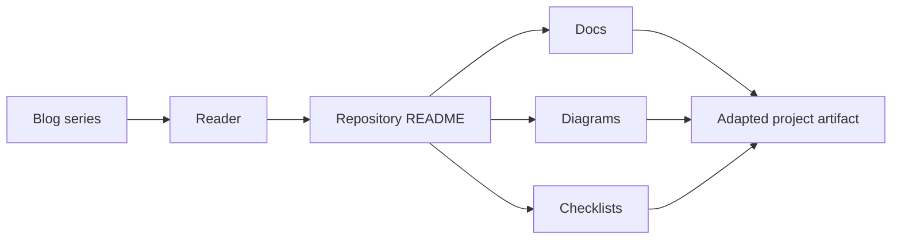

# Architecture

This repository is a companion artifact for the `Documentation and handover` blog series. The blog explains the context and decisions; this repository keeps reusable outputs that can be copied into real work.

## Scope

- handover notes
- ADR records
- troubleshooting guides
- deployment guides
- anonymization checks

## Design Principle

The repository does not mirror a production system. It extracts the parts that are safe and useful to share publicly: templates, diagrams, checklists, examples, and decision frames.
